Prosper Loan Data Exploration by Liming Liu
===========================================

Introduction
============

Prosper.com is a website platform where individuals can either invest in personal loans or request to borrow money. The flow is also called P2P lending.

In this project, we will perform exploratory data analysis on Prosper loan dataset provided by Udacity.The goal is to summarize relationships among variables, reveal any interesting findings and come up with a borrowing cost prediction model at the end. This report will follow below structure:

1.  Overview of the data

2.  Analysis:

-   Univariate analysis and plots
-   Bivariate analysis and plots
-   Multivariate analysis and plots

1.  Final plots and summary

2.  Reflection

Overview of the data
====================

Dataset Structure
-----------------

The dataset contains 113,937 loans with 81 features spanning from year 2005 to 2014 April.

Features/Variables Overview
---------------------------

Summary of the dataset
----------------------

Cleaning Data
-------------

Before the expletory analysis, we will need to clean and wrangle the dataset a little bit. Processes are below:

1.  Create a new column named as 'CreditScore', which is the average number for 'CreditScoreRangeLower' and 'CreditScoreRangeUpper'

2.  Map 'ListingCategory' to factors based on the variable dictionary provided.

3.  Convert 'LoanOriginationDate' type to class of 'date time'

4.  Separate loan origination time in the measurements of:

-   years
-   quarters
-   months
-   years\_quarters

1.  for simplification purpose, reclassify loan status:

-   combine all the past due with days buckets to "Past Due" category
-   'final payment' reclassify to "completed"

1.  Merge 'CreditGrade' and 'ProsperRating..Alpha' in one column named as 'CombinedScore'

Univariate Plots Section
========================

In this section, We will select some variables and examine each closely with plot and description, and summarize at the end.

1.Loanstatus
------------

    ##  Cancelled Chargedoff  Completed    Current  Defaulted   Past Due 
    ##          5      11992      38279      56576       5018       2067

    ## [1] 0.149293

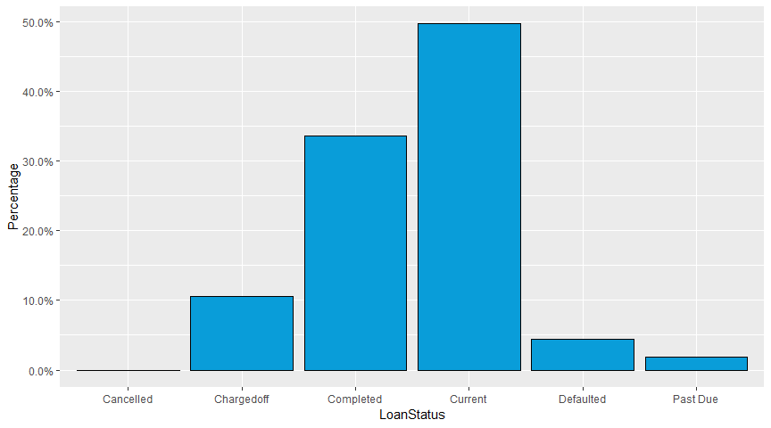

The loans with "current" status account for 50% of all the loans, which is the largest section. The sum of "Default" and "Chargedoff" is 15%, if we assume most of the past due loans will eventually default, the bad debt percentage (total charged off and defaulted loans in this case) could be higher than 15%.

In contrast, as of 2017 the S&P/Experian Consumer Credit Default Composite Index reported that bankcards had the highest default rate at 3.44% of all categories. This shows that loans from Prosper are with a higher default rate.

2. Loan Original Amount
-----------------------

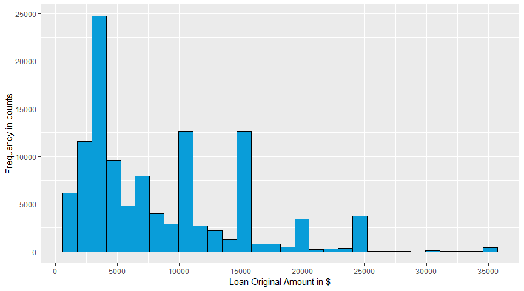

    ##    Min. 1st Qu.  Median    Mean 3rd Qu.    Max. 
    ##    1000    4000    6500    8337   12000   35000

    ## 
    ##  4000 15000 10000  5000  2000 
    ## 14333 12407 11106  6990  6067

The loan size ranges from $1k to $35k. The distribution of the counts on different loan sizeis interesting. Loan size of $4k is most popular, followed by size of $15k and $10k. I would wonder why there are many 4k loans were generated.

3. Loan Origination Year
------------------------

    ##    Min. 1st Qu.  Median    Mean 3rd Qu.    Max. 
    ##    2005    2008    2012    2011    2013    2014

This plot paints the growth picture of Prosper in terms of loan originations. The business started in the later part of 2005 with only 22 loans, increased steadily till year 2007 and remained the same level in 2008, then plummeted to 2000 loans only in 2009 due to the company restructure, then came with an healthy stride each year. Till the end of 2013, there are 34000 loans originated on the platform. Data for 2014 is not complete as of the time of collection.

4. Loan Origination Quarter
---------------------------

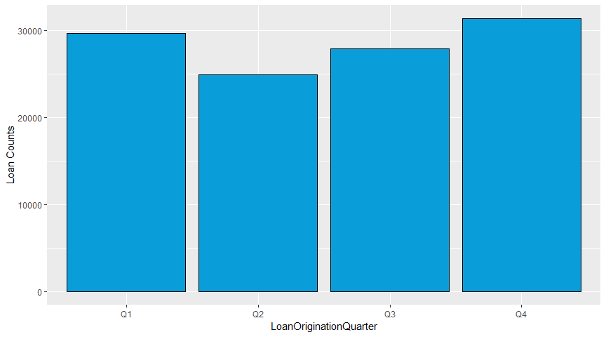

    ## [1] 6480

There seems to be more loans originated in Q4 than other quarters while Q2 is with the lowest loans. The difference between the two quarters is 6480.

5. Loan Origination Month
-------------------------

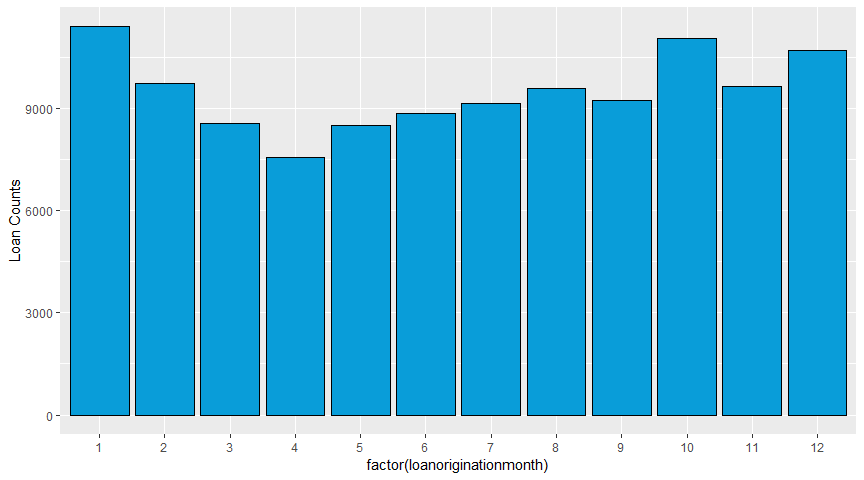

    ##    Min. 1st Qu.  Median    Mean 3rd Qu.    Max. 
    ##   1.000   3.000   7.000   6.592  10.000  12.000

Let us break down by months. Most of the loans are originated in January, then by October and December. There are least loans originated in April. I would doubt this as no data is available for April of some years. We should look at month in year to compare.

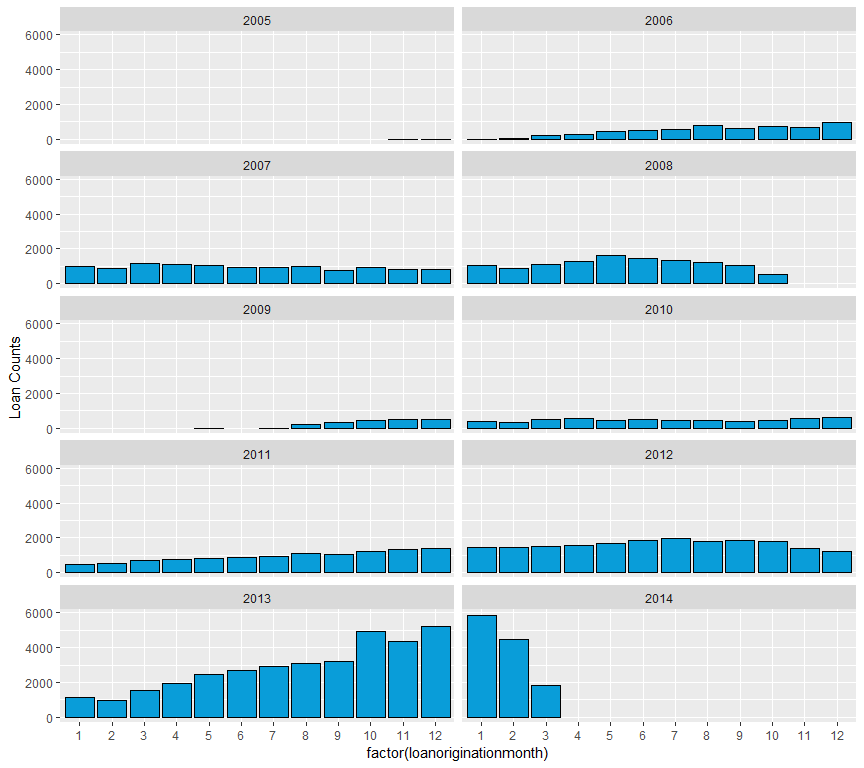

We have found that no data available for April in 2005, 2009 and 2014, thus we should exclude those 'unusual' years to run the plot again.

October has the most loans generated, followed by December. February has the least loans. One of the reason perhaps is consuming motivation is usually strong in holiday season (October, November, December, January). Since consuming motivation already 'burned out' in the holiday season, people are reluctant to borrow at this time, not even mention that there are less day counts in this month. This loan counts pattern is limited by the short time range of the historical data provided. To enforce our conclusion, more data is needed.

6.Borrowers Occupation
----------------------

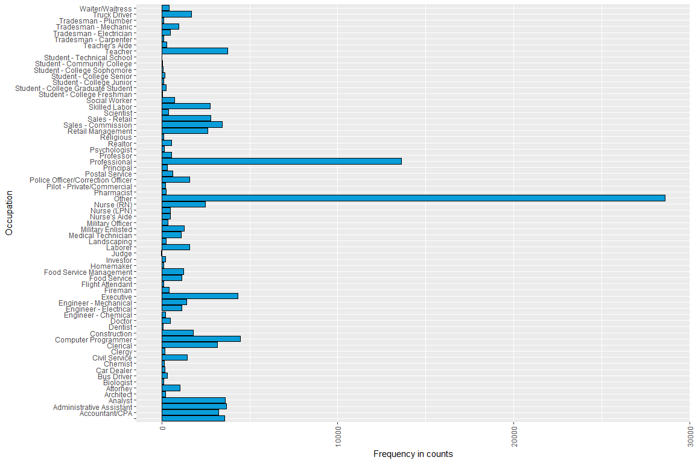

Most people reported their occupation as "Others", followed by "Professional" as people will select among those two categories, if they can not find the right group or just want to make a simple choice.

7.Borrower States
-----------------

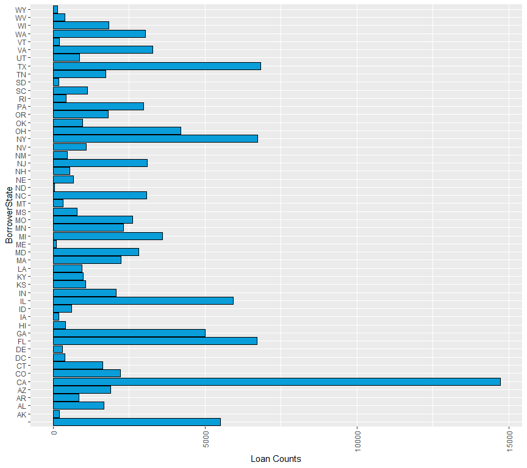

    ## 
    ##    CA    TX    NY    FL    IL          GA    OH    MI    VA    NJ    NC 
    ## 14717  6842  6729  6720  5921  5515  5008  4197  3593  3278  3097  3084 
    ##    WA    PA    MD    MO    MN    MA    CO    IN    AZ    WI    OR    TN 
    ##  3048  2972  2821  2615  2318  2242  2210  2078  1901  1842  1817  1737 
    ##    AL    CT    SC    NV    KS    KY    OK    LA    UT    AR    MS    NE 
    ##  1679  1627  1122  1090  1062   983   971   954   877   855   787   674 
    ##    ID    NH    NM    RI    HI    WV    DC    MT    DE    VT    AK    SD 
    ##   599   551   472   435   409   391   382   330   300   207   200   189 
    ##    IA    WY    ME    ND 
    ##   186   150   101    52

    ## 
    ##   CA   FL   NY   TX   IL   GA   OH   VA   NC   PA   NJ   MI   MD   WA   MO 
    ## 1304  804  721  694  607  502  440  405  361  358  331  321  312  312  275 
    ##   IN   CO   TN   MN   WI   MA   CT   OR   AL   AZ   SC   KS   KY   LA   NV 
    ##  238  235  235  229  207  196  194  166  156  144  132  111  111  111  111 
    ##   MS   AR   OK   UT   NE   DC   RI   NH   ID   NM   WV   HI   SD   DE   MT 
    ##   96   90   83   79   68   64   56   53   48   45   42   34   32   31   31 
    ##   AK   VT   WY        IA   ME   ND 
    ##   26   16   11    0    0    0    0

CA is the top 1 state that originated the highest numbers of loans, followed by TX, NY and FL. We have found there are no loans originated for ND, ME and IA in 2011 and going forward. From my research online, since Prosper relaunched itself and became a security company in 2009, residents of states of Iwoa, Maine and North Dakota were not permitted borrow money through p2p lending platform.

8. DebtToIncome Ratio
---------------------

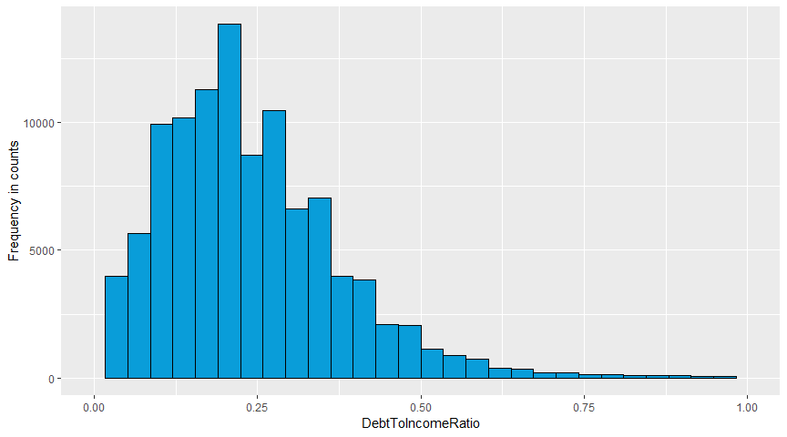

    ##    Min. 1st Qu.  Median    Mean 3rd Qu.    Max.    NA's 
    ##   0.000   0.140   0.220   0.276   0.320  10.010    8554

Median for the debt to income(DTI) ratio is 0.22. Most people's DTI ratio is below 1.

9.Income Range
--------------

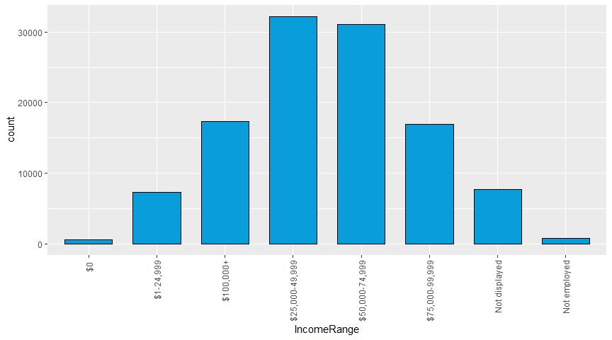

More loan borrower's income is in the range of $25k~$50k and $50k~$75k.However, the income listed in the website is stated by the borrower themselves, further verification is needed. The portion from "Not Displayed" group is also noticable.

10.Credit Score
---------------

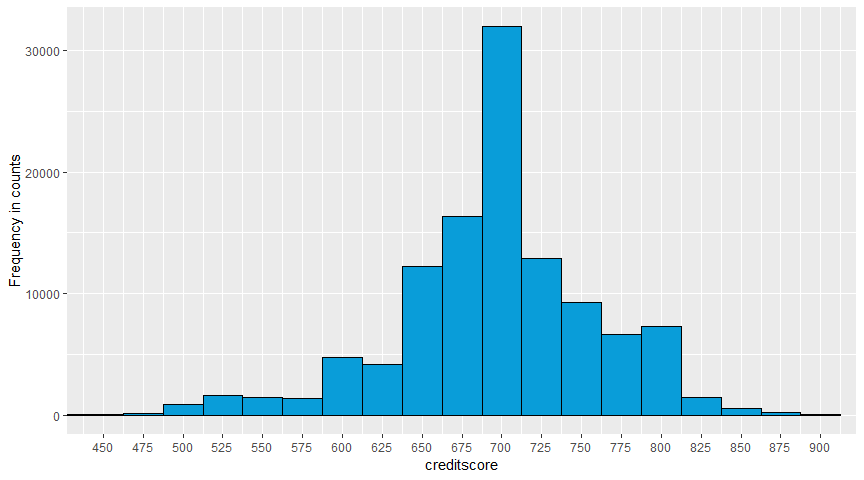

    ##    Min. 1st Qu.  Median    Mean 3rd Qu.    Max.    NA's 
    ##     9.5   669.5   689.5   695.1   729.5   889.5     591

Median and mode of the creditscore is 690.

11. Combined Rating Grade
-------------------------

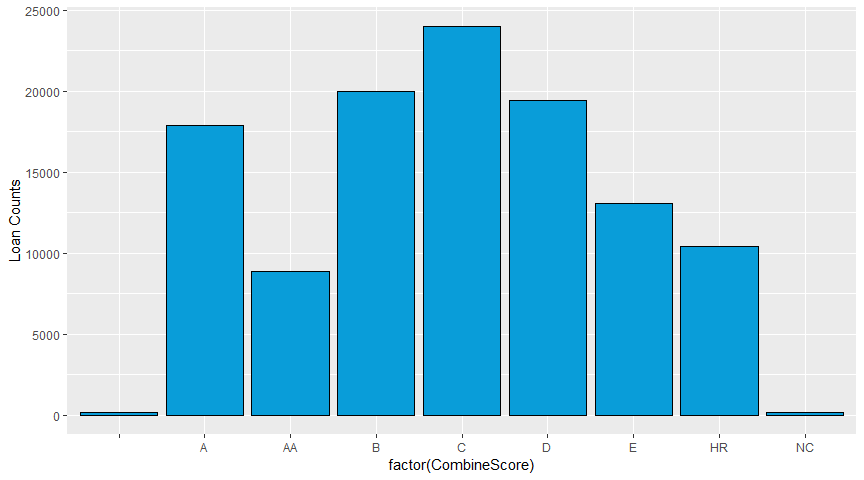

    ## 
    ##           A    AA     B     C     D     E    HR    NC 
    ##   131 17866  8881 19970 23994 19427 13084 10443   141

We have combined the loans ratings in one column at the beginning. There are more loans are in the rating of C. The total loan counts for AA or A group is 26747.

12. Borrower Rate
-----------------

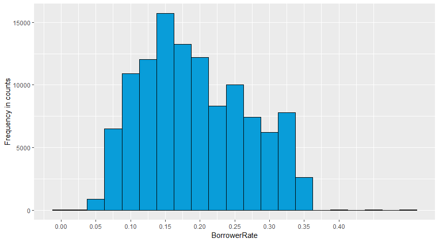

    ##    Min. 1st Qu.  Median    Mean 3rd Qu.    Max. 
    ##  0.0000  0.1340  0.1840  0.1928  0.2500  0.4975

The median of the borrower rate is 0.18. The higheset rate is 0.5. There are 8 loans are with 0 borrower rate orginated in the period of year 2005 to 2008. I would wondery why 0 interest loan were generated.

13. Origination Fee
-------------------

    ##    Min. 1st Qu.  Median    Mean 3rd Qu.    Max.    NA's 
    ## 0.00000 0.01900 0.02502 0.02604 0.03653 0.14935      25

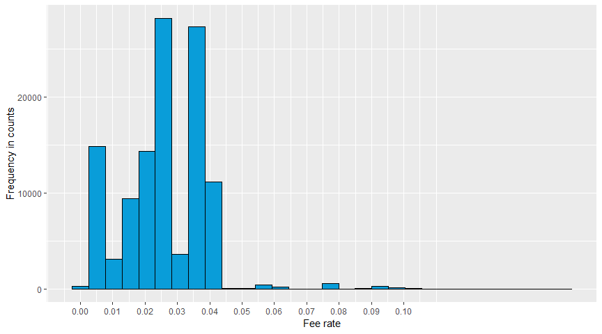

'Fee' refers to the insurance cost and closing fee, which is calculated by Borrower APR subtracted Borrower Rate. The median of the fee is 2.5%. It appears that Fees are fixed at a certain level and would change to another level.

14. Estimated Effective Yield
-----------------------------

    ##    Min. 1st Qu.  Median    Mean 3rd Qu.    Max.    NA's 
    ##  -0.183   0.116   0.162   0.169   0.224   0.320   29084

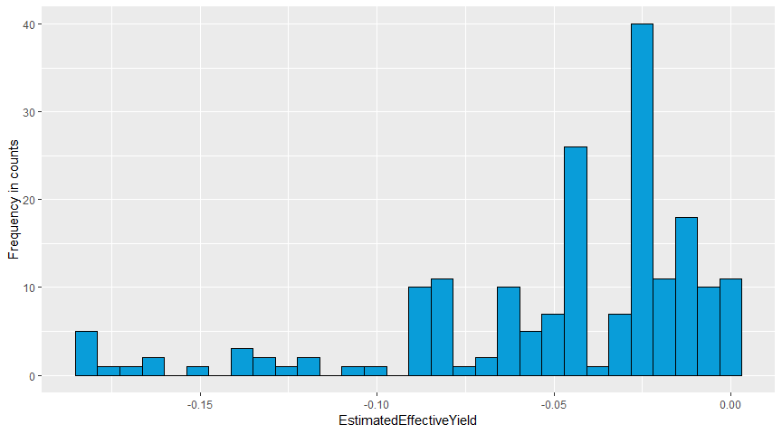

    ## [1] 0.001667588

According to variable dictionary, 'Effective yield' is equal to (1) the borrower interest rate (2) minus the servicing fee rate (3) minus estimated uncollected interest on charge-offs (4) plus estimated collected late fees

The median of the estimated effective yield is 16.9%. About 0.1% of the loans in the dataset generated negative return due to delinquency.It is noticeable that there are 20000+ records with no Effective yield available.

Univariate Analysis
===================

### What is the structure of your dataset?

There are 113937 observations and 81 variables in the dataset.

### What is/are the main feature(s) of interest in your dataset?

Using my business sense, I have chosen 14 variables as the main features listed below:

1.  Loanstatus
2.  Loan Original Amount
3.  Loan Origination Year
4.  Loan Origination Quarter
5.  Loan Origination Month
6.  Borrowers Occupation
7.  Borrower States
8.  DebtToIncome Ratio
9.  Income Range
10. Credit Score
11. Combined Rating
12. Borrower Rate
13. Origination Fee
14. Estimated Effective Yield

### What other features in the dataset do you think will help support your
\#\#\# investigation into your feature(s) of interest?

In addition to variables mentioned above, features will help for the investigation are:

1.  Investors - how many investors would like to fund the loan determines loan size one can get
2.  BankcardUtilization - highly correlate with credit score
3.  Term - support to the loan size and borrower rate one can get
4.  CurrentDelinquencies - has some predict power on if a loan gets defaulted in the future

### Did you create any new variables from existing variables in the dataset?

The new variables created from existing dataset are:

1.  'Fee' refers to the insurance cost and closing fee, which is calculated by Borrower APR subtracted Borrower Rate creditscore: average of upper and lower range of the credit score
2.  'Credit Score' is the average number for 'CreditScoreRangeLower' and 'CreditScoreRangeUpper'
3.  'loanoriginationmonth' is the Loan origination month
4.  loanoriginationyear' is the Loan origination year
5.  Loanoriginationquarter' is the Loan origination Quarte
6.  'CombineScore' is the merge of column of ProsperRating..Alpha. and column of CreditScore

### Of the features you investigated, were there any unusual distributions?

### Did you perform any operations on the data to tidy, adjust, or change the

### form of the data? If so, why did you do this?

We have observed that variable 'ListingCategory' is numeric. To make it more readable, We covert those numbers to factors.Following the guidance from variable dictionary, we map each category from the corresponding number.

In order to find the pattern and create time series analysis, we need to know loan origination year, quarter and month separately. we extract all those information from variable 'LoanOriginationDate' with datatimefunction.

The format for loanoriginationquarteryear is in %Q %Y, we changed it to %Y %Q format.

The LoanStatus categories were: Cancelled, Charged off, Completed, Current, Defaulted, Final Payment In Progress, several Past Due with a different late days buckets. To simplify the categories, we combine all those past due days buckets into one category named as "Past Due".

Another persistent issues are there are few data gaps. Rating was not consistant through. Prosper relaunched itself in 2009, no loans originated due to Suspend time and the rating system was revised for loans originated after relaunch. We need to exclude some years or time points to avoid bias. On the other hand, we need to aggregate those risk ratings to get a more consistent dataset.

Bivariate Plots Section
=======================

In this section, We will look at pair of selected variables with plot and description, and summarize at the end.

Correlation Chart
-----------------

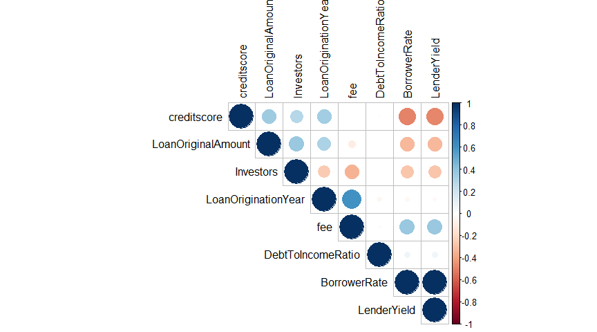

Correlation matrix of all variables continuous and numeric.

There are positive relationships between:

1.  Credit Score and Loan Origination Year
2.  Loan Origination Year and Fee
3.  Loan Original Amount and Investors
4.  Fee and Borrower Rate
5.  Fee and Lender Yield
6.  Borrwo Rate and Lender Yield

There are negative relationships between:

1.  Credit Score and Borrower Rate
2.  Credit Score and Lender Yield
3.  Investors and Fee
4.  Loan Original Amount and Borrower Rate
5.  Loan Original Amount and Lender Yield

Time Series Plots
-----------------

In this section, we will plot selected variables over time series scale to capture any trend or interesting facts of the data.

### Loan status over Year Quarter

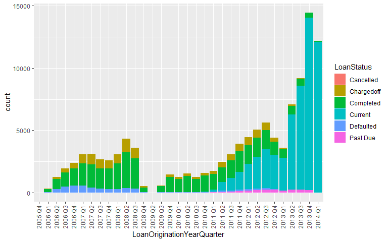

We have observed since Prosper business started in 2005, the loan amounts originated from the platform increased steadily. The current loan go back as far as 2011 Q1, and the the chargedoff loans are as recent as 2013 Q2. However, there is no data available in 2009 first half year due that company is under restructuring. Prosper relaunched itself at Q3 2009 that loan amounts increased and surpassed the highest number in 2008, with a dip at 2012Q4 and 2013 Q1.

### Loan status over Year

Then we look at loan status distribution over year. The portion for completed loans is greater than charged off and defaulted loans. Current portion increased to 25% at 2013. It is noticeable that there are more loans fall under Past Due category since 2011.

### Bad Debt ratio over time

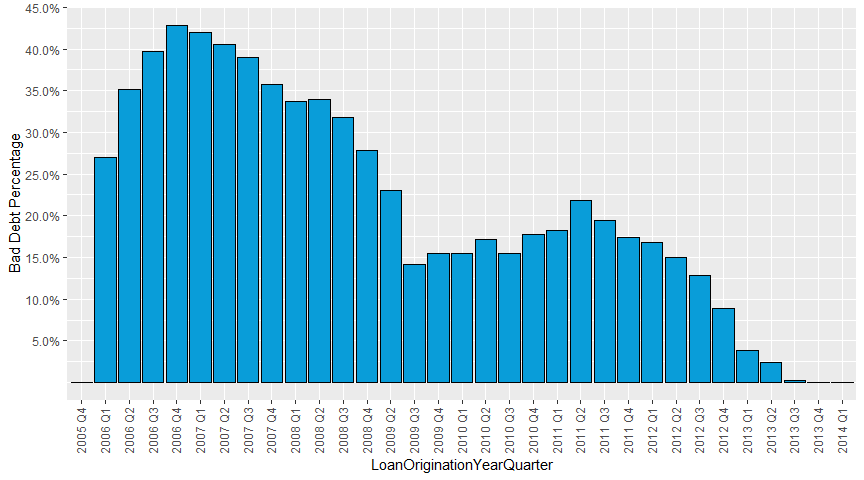

Bad Debt Ratio (BD Ratio) is the total percentage of counts of Charged off and Defaulted loans. We have observed that the BD ratio started from 25% increased to 42% in 2006 Q3 then decreased slowly till 2009 Q3 at 12.5%, then kept level of 20% and below. The reason for the decline could be first the relaunch in 2009 improved minimum loan application criteria thus the entire population is less likely got defaulted or charged off than before and secondly, the there is no enough time to identify the delinquency of the loan.

### Borrower Rate over Year

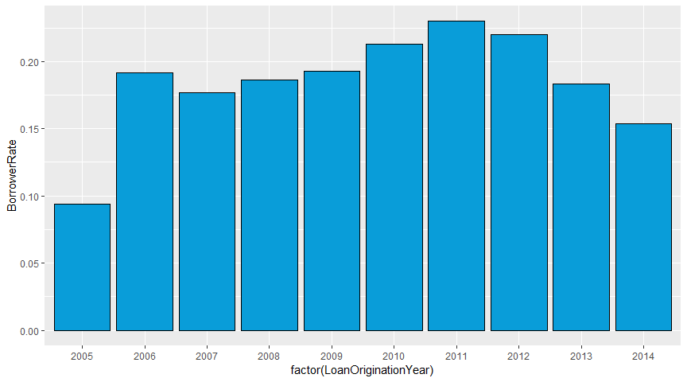

The yearly average borrower rate increased from 10% to 22.3%, declined till 15% in 2014.

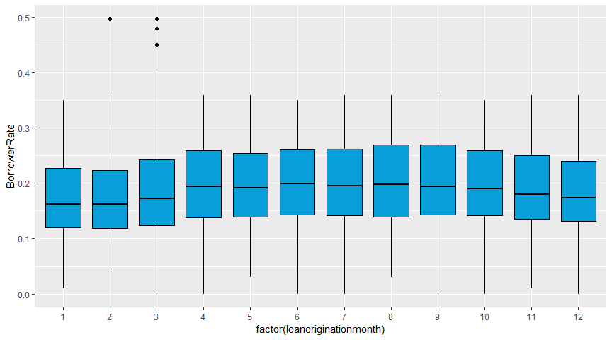

There appears a seasonality trend for the borrower rate. In general it was low for Jan, Feb with a median at 16% and high in June with a median rate of 20

### Credit score over time

There is a clear improvement on the credit score over time, especially after 2009, with a median at 700+. The minimum credit score criteria was raised from below 500 to 600+.

### Rating Grade over Year

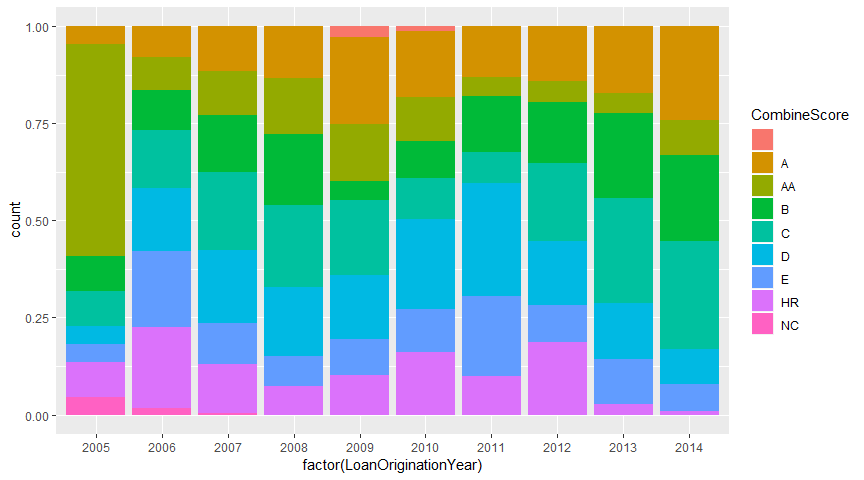

It appears that the proportions for rating of 'A', 'B', 'C' and 'D' increased (with flucutation) and the rest of the rating size were reduced correspondingly up to 2014.

### Estimated Return over time

According to the variable dictionary, the Estimated Return was assigned to the listing at the time it was created. It is the difference between the Estimated Effective Yield and the Estimated Loss Rate. Applicable for loans originated after July 2009. We would consider it as a conservative return we should get from investing the loan from Prosper.

We can see that even though mean of the lender Yield is at around 15% at 2014, the estimated return is around 7.5%

### Total Loan size by Year

The yearly originated loan size from the platform almost doubled every year since 2010 and reached to $362mm in 2013.

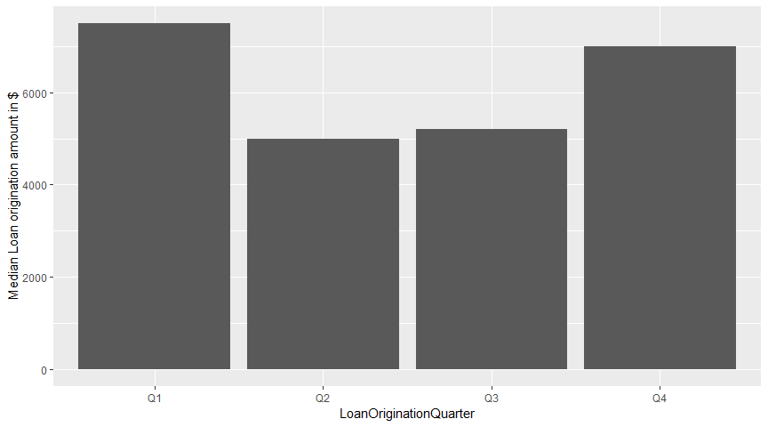

If broken down by quarter, Q2 generated the least loan amount and Q1 generated the largest loan amount.

If broken off by months, June and August generated the least loan amount and Jan generated the largest loan amount

### Loan Size Vs. Term

We have observed that borrowing term for 12 and 60 months happened since 2011. It appears that for the higher loan amounts such as above $25k are more borrowed through 60 months than 36 month. Term of 12 months happen a lot at lower borrowing amount (below $5k).

### Borrower Rate Vs. CreditScore

It appears a negative correlation of square root of borrower rate and credit score, the correlation gets stronger when credit score is over 600.

### Borrower Rate Vs. Loan Origination Amount

The correlation between Borrower Rate and Loan Original Amount is not clear. Further investigation is needed.

### Borrower Rate Vs.LoanStatus

The higher Borrower Rate appeared associated with higher risk (likelihood of the delinquency for the loan).

### Borrower Rate Vs. Occupation

We have observed occupations reported as Teachers Aide, Student, Nurse's Aid and Bus Driver are associated with higher borrower rate. Judge, Pharmacist, Scientist are associated with lower borrower rate.

### Borrower Rate Vs. Debt To Income Ratio

The correlation between Borrower Rate and Loan Original Amount is not strong. Further investigation is needed.

### Borrower Rate Vs. Income Range

    ##  Not displayed   Not employed             $0      $1-24,999 $25,000-49,999 
    ##           7741            806              0           7274          32192 
    ## $50,000-74,999 $75,000-99,999      $100,000+           NA's 
    ##          31050          16916          17337            621

Income range reported as "Not employed" is with highest median borrower rate, followed by $0~$25k, $25k~$50k groups. To my surprise, group of "Not Displayed" is associated with a relative low median rate as of 18%

### Borrower Rate Vs. Rating Grade

    ##    AA     A     B     C     D     E    HR    NC  NA's 
    ##  8881 17866 19970 23994 19427 13084 10443   141   131

Apparently, the better the grade is, the lower of the borrower rate is.

### Borrower Rate Vs. Monthly Stated Income

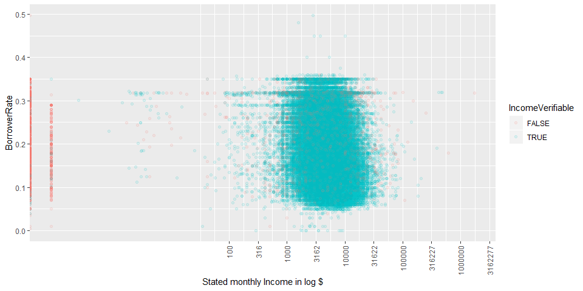

There appears to be a negative correlation between Borrower Rate and stated monthly income.

when we look closely to the points in the scale of income less than $10k, we could not observe any clear correlation.

### Monthly Income Vs. Loan Status

Higher monthly income tends to associated with Current and Completed

### Monthly Income Vs. DTI ratio

We have zoomed in and use a log scale on the monthly income, and find that there is a weakly negative correlation between DTI ratio and Stated monthly income.

### Loan status Vs. Credit Score

    ##  Cancelled Chargedoff  Completed    Current  Defaulted   Past Due 
    ##          5      11992      38279      56576       5018       2067

Just by looking at the median for each categories, Charged off and Defaulted loans are with lowest credit score for 670 and 650, respectively. Interesting finding is that the 75% percentile reached below 600 for Defaulted loans while that is above 600 for Charged off group.

Loan status Vs. Loan original amount
------------------------------------

It is noticeable that the median loan amount is around $5k for charged off and defaulted loans. "Current" loans are larger probably because the increase in loan size over time on the Prsper platform.

### Loan status Vs. DTI ratio

It is clear to us that mean DTI ratio for Charged off and Defaulted loans are higher (with a ratio around 0.35) than other categories.

### Risk Rating Vs. DTI ratio

Apparently, the better grade rating is, the lower DTI ratio is.

Bivariate Analysis
==================

### Talk about some of the relationships you observed in this part of the
investigation. How did the feature(s) of interest vary with other features in
the dataset?

By running correlation matrix among numeric variables, we have found strong positive relationships between:

Borrower Rate and Lender Yield Loan Origination Year and Fee Loan Original Amount and Investors Borrower Rate and delinquency likelihood

strong negative relationships between:

Credit Score and square root of Borrower Rate Credit Score and Lender Yield Investors and Fee The higher monthly income is, the less likely loan get deliquent

### Did you observe any interesting relationships between the other features
(not the main feature(s) of interest)?

1.  We have also found these features related to time:

-   There is a gap for loans generated in 2009. This observation matched the fact that Prosper was under restructure and enforced to register in SEC as security company in 2009. Prosper relaunched itself in the Q3 of 2009 and loans were generated again after then. Loan sizes doubled each year and reached to $362mm in 2013.
-   There is a seasonal pattern to the total loan amounts.
-   Credit Score requirement improved over time.
-   The overall Prosper portfolio shifts to less risky loans over time.

1.  Other features are found:

-   To repay the principle on time, the larger of the loan size, the longer term the borrower tend to get.
-   Occupations reported as Teachers Aide, Student, Nurse's Aid and Bus Driver are associated with higher borrower rate. Those of Judge, Pharmacist, Scientist are associated with lower borrower rate.
-   Generally, the higher one income was reported, the lower of the borrower rate one can get. However, group of "Not Displayed" is associated with a relative low median rate as of 18%.

### What was the strongest relationship you found?

1.  Lender Rate and Estimated Effective Return

There is very strong positive relationship between Lender Rate and Estimated Effective Return. We can think of Estimated Effective Return as a true conservative return of investing the loan from Prosper.In 2014, even though mean of the lender Yield is at around 15%, the estimated return (true return) is around 7.5%.

1.  Borrower Rate and Credit Score

There is very strong negative relationship between square root of borrower rate and credit score, the correlation gets stronger when credit score is over 600.

1.  Borrower Rate and Risk Ranking

The better of the risk grade is, the lower of the Borrower Rate. For example, 'AA' loans are with a mean Borrower Rate of 8%. In the contrary, 'HR' loans are with 30%.

1.  DTI ratio and Risk Ranking

The better of the risk grade is, the lower of the DTI ratio. For example, 'AA' loans are with a mean DTI ratio of 0.2. In the contrary, 'HR' loans are with 0.3.

Multivariate Plots Section
==========================

### Loan Amount, Purpose over time

Before 2008, no loan purpose category was reported. Since 2008, Debt Consolidation seem the top 1 borrowing reason. The variety of listing category increases over time. For example, vacation loans started to be reported since 2012.

### lenderyield, borrower rate over time

The difference between Borrower Rate and Lender Yield was wide and volatile at the beginning and became more stable since 2009.

### Borrower Rate, Income, Income Range

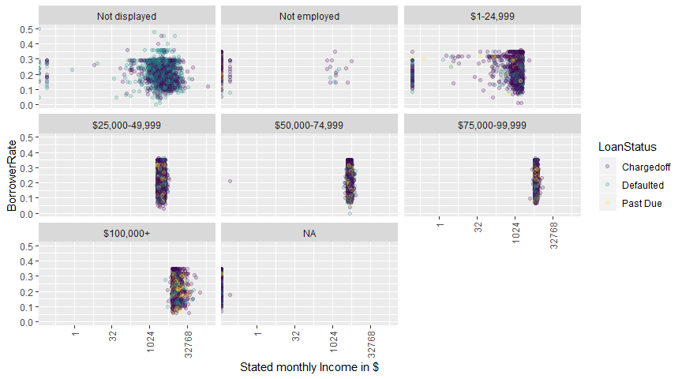

Among different income ranges, there are more defaulted loans in the 'Not Displayed' group. There are more charged off loans in the "1-$30k" group. 'Not displayed' group tend to have more dispersed borrower rate than other groups.

### Borrower Rate, Loan original amount, and credit score

The points representing borrowers of loans with high credit scores are closer to the bottom part of the chart. They generally can get lower interest rates and larger loan amounts.

### Borrower Rate, Rating Grades, in each year

    ## [1] "AA" "A"  "B"  "C"  "D"  "E"  "HR" "NC"

    ##    AA     A     B     C     D     E    HR    NC  NA's 
    ##  8881 17866 19970 23994 19427 13084 10443   141   131

The upper and lower quartiles of the borrower rate are much closer since 2011.

### DTI Vs. Risk Ranking over year

Before year 2009, there is no clear correlation between DTI ratio to risk ranking. After 2009 we can observe that in general, the better of the risk grade is, the lower of the DTI ratio. We can connect this observation with the restructure of Prosper in 2009. Perhaps Prosper modified the risk ranking system in 2009. Borrower DTI ratio is controlled in a certain range.

### Monthly Income Vs. DTI ratio, Credit Score

Most borrowers DTI ratio is below 1.0 . Among all loan status categories, Past Due and Defaulted loans have the lowest DTI ratio range, but this could be due to the small number of loan data points with Past Due and Default status. The darker color at the Default status charge shows lower credit score, which is expected. The overall shape between the DebtToIncomeRatio and MonthlyIncome is similar among all loan statuses, and the credit score color map does not show any pattern on any of the plot by loan status, so we did not extract any unique insight from these plot.

### Math model

    ## 
    ## Calls:
    ## m1: lm(formula = I(BorrowerRate) ~ I(creditscore), data = df)
    ## m2: lm(formula = I(BorrowerRate) ~ I(creditscore) + creditscore, 
    ##     data = df)
    ## m3: lm(formula = I(BorrowerRate) ~ I(creditscore) + creditscore + 
    ##     StatedMonthlyIncome, data = df)
    ## m4: lm(formula = I(BorrowerRate) ~ I(creditscore) + creditscore + 
    ##     StatedMonthlyIncome + IncomeRange, data = df)
    ## m5: lm(formula = I(BorrowerRate) ~ I(creditscore) + creditscore + 
    ##     StatedMonthlyIncome + IncomeRange + ListingCategory, data = df)
    ## m6: lm(formula = I(BorrowerRate) ~ I(creditscore) + creditscore + 
    ##     StatedMonthlyIncome + IncomeRange + ListingCategory, data = df)
    ## 
    ## =====================================================================================================================================================
    ##                                                            m1              m2              m3              m4              m5              m6        
    ## -----------------------------------------------------------------------------------------------------------------------------------------------------
    ##   (Intercept)                                              0.554***        0.554***        0.553***        0.587***        0.585***        0.585***  
    ##                                                           (0.002)         (0.002)         (0.002)         (0.002)         (0.002)         (0.002)    
    ##   I(creditscore)                                          -0.001***       -0.001***       -0.001***       -0.001***       -0.001***       -0.001***  
    ##                                                           (0.000)         (0.000)         (0.000)         (0.000)         (0.000)         (0.000)    
    ##   StatedMonthlyIncome                                                                     -0.000***        0.000**         0.000***        0.000***  
    ##                                                                                           (0.000)         (0.000)         (0.000)         (0.000)    
    ##   IncomeRange: .L                                                                                         -0.005***       -0.029***       -0.029***  
    ##                                                                                                           (0.001)         (0.001)         (0.001)    
    ##   IncomeRange: .Q                                                                                         -0.044***       -0.023***       -0.023***  
    ##                                                                                                           (0.001)         (0.001)         (0.001)    
    ##   IncomeRange: .C                                                                                          0.050***        0.033***        0.033***  
    ##                                                                                                           (0.001)         (0.001)         (0.001)    
    ##   IncomeRange: ^4                                                                                         -0.038***       -0.026***       -0.026***  
    ##                                                                                                           (0.001)         (0.001)         (0.001)    
    ##   IncomeRange: ^5                                                                                          0.021***        0.014***        0.014***  
    ##                                                                                                           (0.001)         (0.001)         (0.001)    
    ##   IncomeRange: ^6                                                                                         -0.010***       -0.007***       -0.007***  
    ##                                                                                                           (0.001)         (0.001)         (0.001)    
    ##   ListingCategory: Debt Consolidation/Not Available                                                                        0.044***        0.044***  
    ##                                                                                                                           (0.001)         (0.001)    
    ##   ListingCategory: Home Improvement/Not Available                                                                          0.064***        0.064***  
    ##                                                                                                                           (0.001)         (0.001)    
    ##   ListingCategory: Business/Not Available                                                                                  0.064***        0.064***  
    ##                                                                                                                           (0.001)         (0.001)    
    ##   ListingCategory: Persona Loan/Not Available                                                                              0.009***        0.009***  
    ##                                                                                                                           (0.001)         (0.001)    
    ##   ListingCategory: StudentUse/Not Available                                                                                0.031***        0.031***  
    ##                                                                                                                           (0.002)         (0.002)    
    ##   ListingCategory: Auto/Not Available                                                                                      0.055***        0.055***  
    ##                                                                                                                           (0.001)         (0.001)    
    ##   ListingCategory: Other/Not Available                                                                                     0.067***        0.067***  
    ##                                                                                                                           (0.001)         (0.001)    
    ##   ListingCategory: Baby&Adoption/Not Available                                                                             0.053***        0.053***  
    ##                                                                                                                           (0.004)         (0.004)    
    ##   ListingCategory: Boat/Not Available                                                                                      0.042***        0.042***  
    ##                                                                                                                           (0.007)         (0.007)    
    ##   ListingCategory: Cosmetic Procedure/Not Available                                                                        0.083***        0.083***  
    ##                                                                                                                           (0.007)         (0.007)    
    ##   ListingCategory: Engagement Ring/Not Available                                                                           0.056***        0.056***  
    ##                                                                                                                           (0.004)         (0.004)    
    ##   ListingCategory: Green Loans/Not Available                                                                               0.065***        0.065***  
    ##                                                                                                                           (0.008)         (0.008)    
    ##   ListingCategory: Household Expenses/Not Available                                                                        0.077***        0.077***  
    ##                                                                                                                           (0.002)         (0.002)    
    ##   ListingCategory: Large Purchases/Not Available                                                                           0.054***        0.054***  
    ##                                                                                                                           (0.002)         (0.002)    
    ##   ListingCategory: Medical/Dental/Not Available                                                                            0.064***        0.064***  
    ##                                                                                                                           (0.002)         (0.002)    
    ##   ListingCategory: Motorcycle/Not Available                                                                                0.058***        0.058***  
    ##                                                                                                                           (0.004)         (0.004)    
    ##   ListingCategory: RV/Not Available                                                                                        0.063***        0.063***  
    ##                                                                                                                           (0.009)         (0.009)    
    ##   ListingCategory: Taxes/Not Available                                                                                     0.067***        0.067***  
    ##                                                                                                                           (0.002)         (0.002)    
    ##   ListingCategory: Vacation/Not Available                                                                                  0.064***        0.064***  
    ##                                                                                                                           (0.002)         (0.002)    
    ##   ListingCategory: Wedding Loans/Not Available                                                                             0.064***        0.064***  
    ##                                                                                                                           (0.002)         (0.002)    
    ## -----------------------------------------------------------------------------------------------------------------------------------------------------
    ##   R-squared                                                0.213           0.213           0.215           0.257           0.311           0.311     
    ##   adj. R-squared                                           0.213           0.213           0.215           0.257           0.311           0.311     
    ##   sigma                                                    0.066           0.066           0.066           0.064           0.062           0.062     
    ##   F                                                    30684.346       30684.346       15478.726        4882.395        1820.712        1820.712     
    ##   p                                                        0.000           0.000           0.000           0.000           0.000           0.000     
    ##   Log-likelihood                                      146748.641      146748.641      146856.110      149258.821      153523.533      153523.533     
    ##   Deviance                                               498.165         498.165         497.221         467.143         433.101         433.101     
    ##   AIC                                                -293491.283     -293491.283     -293704.220     -298497.642     -306987.066     -306987.066     
    ##   BIC                                                -293462.368     -293462.368     -293665.667     -298401.315     -306698.085     -306698.085     
    ##   N                                                   113346          113346          113346          112725          112725          112725         
    ## =====================================================================================================================================================

We have created a series of linear regression models to predict borrower rate by given information. The independent variables are Credit Score, Stated Monthly Income and Income Range, ListingCategory, ListingCategory. The R-square is 0.31 in the final model, which do not show very strong linear prediction power.

Multivariate Analysis
=====================

### Talk about some of the relationships you observed in this part of the
investigation. Were there features that strengthened each other in terms of
looking at your feature(s) of interest?

1.  We plot the points for Borrower Rate with Loan Status of 'Charged off', 'Defaulted' and 'Past Due' for each income range. Generally speaking, bad debt (Charged-off, Defaulted and Past Due loans in this case) occurred across all Income ranges. However, in the "Not displayed" group, there are many more defaulted and charged off data points than other categories. This observation agrees with the relationship between borrowers income and likelihood of delinquency.

2.  We plot the points for Borrower Rate and loan original amount through credit score from 600 to 880. The higher of the credit score is, the lower of the borrower rate. This shows the negative relationship between borrowers' credit score and funding cost.

### Were there any interesting or surprising interactions between features?

1.  We plot the gap between Borrower Rate and Lender Yield by each quarter in measurement of max, mean, median, and min. The spread was volatile at beginning and converge to around 1%. The spread is basically a servicing fee charged by Prosper from investor, and we can infer that Prosper made some improvements on stabilizing the servicing fee. Related news is after Prosper relaunched itself in 2009, instead dropping a loan on the market and letting investor bid on the rate, Prosper used algorithm based on borrow information to set a fixed borrower rate.

2.  Following with my last point, by plotting the whisker box for Borrower Rate and risk grade over year, we have also found the borrower rate were getting more and more stable, falling with a small range.

3.  We plot the box for debt to income ratio with different rating score (from 'AA' to 'HR' in each year). Interestingly, median DTI within different rating group is getting more similar except for HR. This indicates some kind of control improvement from Proper lending process.

### OPTIONAL: Did you create any models with your dataset? Discuss the
strengths and limitations of your model.

We have created a linear regression model with the data set. The model is to predict borrower rate with independent variables of Credit Score, Stated Monthly Income, Income Range, ListingCategory and ListingCategory . The R-square is 0.31, which is considered as a weak prediction power. Strengths of this model is: Selected most influential variables from 81 ones, including both numerical and categorical variables.
It's a simple linear regression, easy to interpret to non - loan professionals

The limitations of this model is: As the prediction power indicates, linear regression might not be ideal in this case, we may try different regression methods The historical data is only for 9 years, even with some trends, we are not sure if this trend is stable. Some variables are highly correlated, may reduce the predicting power.

------------------------------------------------------------------------

Final Plots and Summary
=======================

### Plot One

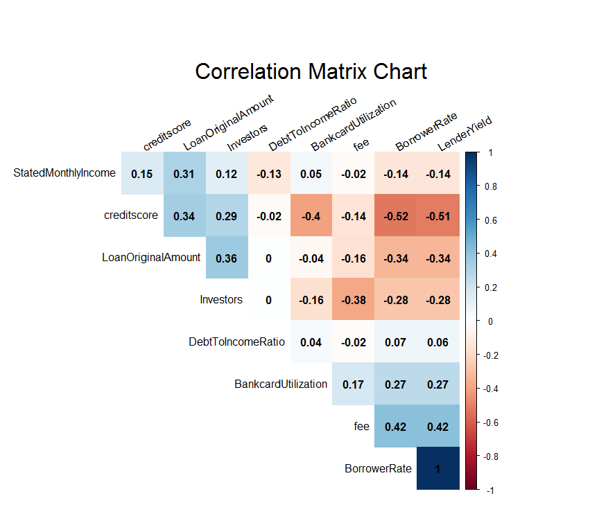

    ## numeric(0)

### Description One

Correlation matrix of all variables continuous and numeric. We have observed that among the those variables:

strong positive relationships:

Borrower Rate Vs. Lender Yield Fee Vs. Borrower Rate Fee Vs. Lender Yield
Loan Origination Amount Vs. Investor
Loan Origination Amount Vs. Credit Score

Negative relationships:

Credit Score Vs. Borrower Rate
Credit Score Vs.Lender Yield BankcardUtilization Vs. Credit Score Investors Vs. Fee

To my surprise, there is no strong correlation observed with variable-DTI Ratio.

### Plot Two

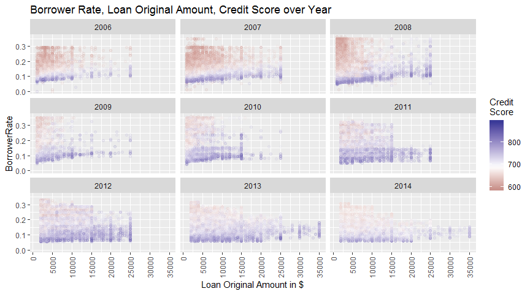

### Description Two

To plot the chart nicely, we set credit score only from 600 to 880. We can easily see that for each chart, bottom points are with lighter colors than the top ones. With that saying, the higher of the credit score, the lower of the borrower rate. For the loan original amount over $25k , it appears that since 2009, the borrower rate remained in a lower range of 10%~20%. In addition, there are more and more large size loans created. With time being, the loan original amount limits increased from $25k to $35k. Loan size of $20k, $25k, $30k and $35k are more popular than other sizes.

### Plot Three

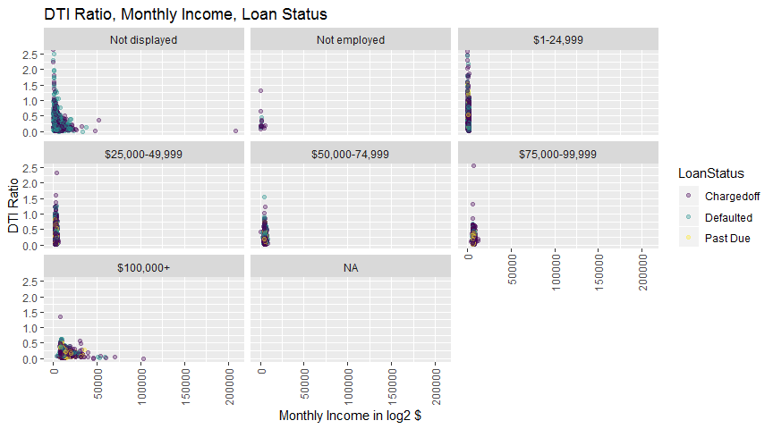

### Description Three

To make the plot easily understood, we only include risky loan status (Charged off, Defaulted and Past Due). The Bad debt (Charged-off, Defaulted and Past Due loans in this case) occured across all Income groups. However, in the "Not Displayed" group, the defaulted rate is the highest, in the other word, the most risky, and the DTI ratio points are all over the place. The second risky group is "$1~$24999" group. When income increases, DTI ratio range is getting thinner, from all over the place to a range 0~0.5. We can infer from this that the more income one get, the bigger the denominator, and the the lower the DTI ratio. The loan he/she gets is less likely to go default.

------------------------------------------------------------------------

Reflection
==========

The Prospser loans dataset contains over 100k records with 81 variables across 9 years. The first obstacle is to understand all the variables and terminology and get familiar with loan industry. We tacked down this issue by looking up information on Google and reading related articles. Second hurdle was in determining which variables to analyze on. Running a correlation matrix gives us some brief ideas on the answers. Another persistent issue is not sure which technique to use to plot among multiple plotting options.

However, there are successes with this project.

1.  Exploring selected variables individually, we are able to connect our observation to the business change happened before such as Prosper reluanch and regulation changed in 2019.

2.  Some unknown relationship was found against borrower rate. Except for the "well known" Credit Score, loan original amount, investors, Income are also good references.

3.  Interesting findings on States lending permissions, Borrower Rate control, lending spread tightness, significance for DTI ratio, loan purpose change, etc..

Additional data such as current 2018 data would enhance our conclusion. The predicting power of the linear regression model we built is very weak. Thus, a different regression model should be brought up to solve this problem better. Having the borrower's age and sex would allow analysis to possibly discover trends among men and women or young and old.
